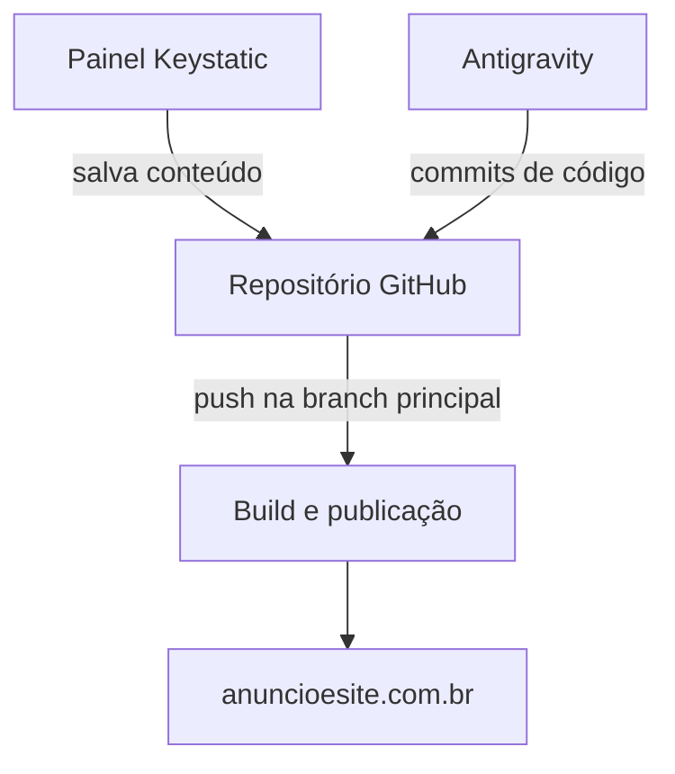

# IMPLEMENTACAO.md — Arquitetura técnica, publicação e verificação

**Versão:** 0.3  
**Data:** 11 de setembro de 2026  
**Estado:** stack técnica aprovada; nome do repositório, WhatsApp e hospedagem comercial definitiva ainda pendentes  
**Responsável:** Willian Souza

## 1. Função deste documento

Este documento define como o site da Anúncio e Site deverá ser construído, publicado, editado e verificado.

Ele existe para orientar Willian e qualquer IA utilizada na IDE sobre:

- tecnologias recomendadas;
- organização do código;
- publicação pelo GitHub;
- funcionamento do painel de conteúdo;
- desempenho;
- acessibilidade;
- SEO técnico;
- instalação futura de medição;
- segurança e recuperação;
- critérios mínimos para considerar uma versão pronta.

Este arquivo não pode alterar preços, condições comerciais, posicionamento, arquitetura de páginas ou direção visual. Para esses assuntos, prevalecem:

1. `PRODUCT.md`;
2. `docs/OFERTA.md`;
3. `docs/ARQUITETURA.md`;
4. `docs/DESIGN.md`;
5. `docs/CONTEUDO-SEO.md`;
6. `docs/DECISOES.md`.

Quando houver conflito entre documentos, a implementação deverá parar naquele ponto e o conflito deverá ser apresentado a Willian. A IA não deverá escolher silenciosamente uma das versões.

## 2. Decisões informadas por Willian

| Tema | Decisão |
|---|---|
| Tipo de desenvolvimento | Código moderno, sem Elementor ou WordPress |
| Projeto anterior | Não precisa ser preservado; o site pode ser reconstruído do zero |
| Controle de versão | GitHub |
| Publicação atual | Vercel conectada ao GitHub |
| Domínio | `anuncioesite.com.br`, registrado pela HostGator |
| DNS atual | Direcionado para a Vercel |
| Acompanhamento | Willian quer visualizar o site no domínio conforme os commits forem publicados |
| Conteúdo editável | Artigos e estudos de caso |
| Painel | Deve existir acesso com login para criar e editar conteúdo |
| Campos do painel | Poderão existir campos editoriais e de SEO, mas os não essenciais não serão obrigatórios |
| Conversão inicial | WhatsApp |
| Formulário | Não entra no lançamento; poderá ser adicionado depois |
| E-mail informado | `contrato@grupows.com` |
| Medição | GTM e GA4 serão instalados depois que o site estiver pronto |
| Materiais | Willian possui foto e capturas de alguns trabalhos; novas capturas poderão ser produzidas |
| Busca interna | Não entra no lançamento |
| Comentários | Não entram no lançamento |
| Newsletter | Não entra no lançamento |
| Manutenção | Realizada pelo próprio Willian |
| Stack aprovada | Astro, TypeScript e CSS próprio |
| Painel aprovado | Keystatic Cloud integrado ao GitHub |
| Visibilidade do repositório | Privado; não existe vantagem técnica em torná-lo público |
| Plano atual da Vercel | Hobby, mantido temporariamente durante a construção |
| Endereço canônico escolhido | `https://www.anuncioesite.com.br` |
| WhatsApp | Poderá ser definido depois, mas será obrigatório antes do lançamento comercial |

## 3. Stack técnica aprovada

Willian aprovou expressamente esta stack em 11 de setembro de 2026.

| Camada | Decisão técnica |
|---|---|
| Framework | Astro, na versão estável mais recente disponível na criação do projeto |
| Linguagem | TypeScript com configuração estrita |
| Páginas públicas | HTML pré-renderizado sempre que possível |
| Estilos | CSS próprio, organizado com variáveis, estilos globais controlados e estilos locais dos componentes |
| Componentes públicos | Componentes Astro; JavaScript somente onde houver comportamento real |
| Painel editorial | Keystatic integrado ao Astro |
| Autenticação editorial | Keystatic Cloud conectado ao GitHub |
| Formato editorial | Markdoc para o corpo do conteúdo e metadados estruturados no próprio repositório |
| Coleções | Artigos e estudos de caso |
| Imagens editoriais iniciais | Arquivos no repositório, otimizados durante a construção |
| Controle de versão | GitHub |
| Hospedagem durante a construção | Vercel Hobby, como situação temporária |
| Hospedagem para o lançamento comercial | Vercel em plano compatível ou alternativa ainda a decidir |
| Gerenciador de pacotes | pnpm, com versão registrada em `package.json` |
| Runtime | versão LTS ativa do Node.js no início da implementação, fixada no projeto |

### 3.1 Por que Astro

O projeto é composto principalmente por:

- páginas comerciais;
- portfólio;
- estudos de caso;
- blog;
- páginas regionais e profissionais;
- conteúdo que precisa carregar rapidamente e ser encontrado por buscadores.

Astro foi criado para sites orientados a conteúdo, permite entregar zero JavaScript por padrão e possui coleções de conteúdo com validação. Isso combina melhor com este projeto do que iniciar uma aplicação React completa para páginas que são, em sua maioria, conteúdo público.

O uso de Astro não impede interações ou animações. Recursos interativos poderão ser adicionados como pequenas ilhas, hidratadas somente quando necessário.

### 3.2 Uso controlado de React

React não está proibido. Ele poderá ser usado pelo painel do Keystatic ou em um componente específico que realmente precise dele.

O site público não deverá carregar React globalmente apenas para:

- abrir o menu;
- revelar elementos durante a rolagem;
- mover um carrossel simples;
- trocar classes;
- exibir conteúdo estático.

Esses comportamentos deverão usar HTML, CSS e TypeScript leve sempre que forem suficientes.

### 3.3 Sem biblioteca visual genérica

Não será adotado um kit visual pronto como base estética. O design deverá ser implementado a partir de `docs/DESIGN.md`, com:

- tokens próprios de cor, tipografia, espaço e movimento;
- componentes desenhados para a Anúncio e Site;
- cantos quase retos;
- ritmo entre seções claras e escuras;
- detalhes laranja;
- hierarquia editorial própria.

Uma biblioteca poderá ser usada para uma necessidade técnica isolada, desde que não determine a aparência do site e não aumente desnecessariamente o JavaScript público.

## 4. Arquitetura geral proposta



### 4.1 Site público

As páginas públicas deverão ser pré-renderizadas no build sempre que possível. Isso inclui:

- página inicial;
- páginas de serviço;
- portfólio;
- estudos de caso publicados;
- blog;
- artigos publicados;
- página Sobre;
- página regional;
- política de privacidade;
- página de erro 404.

Conteúdo essencial não poderá depender de JavaScript para aparecer. Títulos, parágrafos, links, preço, serviços, autoria e informações de contato deverão existir no HTML entregue.

### 4.2 Rotas editoriais

Artigos e estudos de caso usarão rotas dinâmicas no projeto, mas serão transformados em páginas públicas durante o build:

- `src/pages/blog/[slug].astro`;
- `src/pages/portfolio/[slug].astro`.

Somente itens marcados como publicados poderão gerar páginas indexáveis.

### 4.3 Painel editorial

O painel ficará em uma rota administrativa não exibida no menu, inicialmente:

- `/keystatic/`.

Requisitos:

- login autenticado;
- acesso limitado a usuários autorizados;
- ausência no sitemap;
- instrução `noindex`;
- nenhuma credencial salva no repositório;
- conteúdo salvo no GitHub;
- campos de criação e edição em português sempre que a ferramenta permitir;
- coleção separada para artigos;
- coleção separada para estudos de caso.

A URL do painel não será tratada como proteção. A segurança dependerá da autenticação.

## 5. Gestão de conteúdo

### 5.1 Solução recomendada

Usar Keystatic Cloud conectado ao repositório do projeto.

Motivos:

- fornece interface administrativa;
- autentica o acesso;
- trabalha com conteúdo versionado no GitHub;
- não exige WordPress nem banco de dados tradicional;
- integra-se oficialmente ao Astro;
- permite que o mesmo conteúdo seja editado no painel ou no código;
- o plano gratuito informado pela documentação atende até três usuários, enquanto a operação inicial terá apenas Willian.

O serviço de imagens em nuvem do Keystatic não é necessário no lançamento. As imagens poderão permanecer no repositório. Uma solução externa só deverá ser avaliada se o volume de imagens tornar o repositório inadequado.

### 5.2 Fluxo editorial

1. Willian acessa o painel autenticado.
2. Cria ou edita um artigo ou estudo de caso.
3. Salva inicialmente como rascunho.
4. Revisa conteúdo, links, imagens e campos essenciais.
5. Altera o estado para publicado.
6. O conteúdo é salvo no GitHub.
7. A plataforma de hospedagem executa um novo build.
8. A versão publicada aparece no domínio.

Salvar um rascunho poderá gerar commit e build, mas o item não poderá aparecer em listagens, sitemap ou URL pública indexável.

### 5.3 Campos dos artigos

| Campo | Regra | Comportamento quando vazio |
|---|---|---|
| Título | Obrigatório | Não permite salvar como publicado |
| Slug | Obrigatório | Gerado inicialmente pelo título e editável antes da publicação |
| Conteúdo | Obrigatório | Não permite publicar |
| Estado | Obrigatório | Começa como rascunho |
| Data de publicação | Obrigatória apenas para publicação | Usar a primeira data pública real; nunca retroativa |
| Data de atualização | Opcional | Não mostrar se não houve atualização relevante |
| Resumo | Opcional | Usar trecho inicial cuidadosamente limitado |
| Categoria | Opcional | Exibir sem categoria |
| Imagem principal | Opcional | Layout deve funcionar sem imagem |
| Texto alternativo | Obrigatório quando houver imagem informativa | Imagem não pode ser publicada sem descrição adequada |
| Título de SEO | Opcional | Usar o título editorial |
| Descrição de SEO | Opcional | Usar resumo ou trecho inicial, com revisão do tamanho |
| URL canônica especial | Opcional e avançada | Usar a própria URL do artigo |
| Fontes | Opcional | Não renderizar seção vazia |
| Conteúdos relacionados | Opcional | Usar relacionamento automático ou omitir o bloco |
| Autor | Automático | `Willian Souza` |

O painel deverá explicar os campos avançados com textos de ajuda simples. Nenhum usuário será obrigado a preencher um campo apenas porque ele existe.

### 5.4 Campos dos estudos de caso

| Campo | Regra | Comportamento quando vazio |
|---|---|---|
| Título | Obrigatório | Não permite publicar |
| Slug | Obrigatório | Gerado pelo título e revisável |
| Estado | Obrigatório | Começa como rascunho |
| Resumo | Obrigatório | Usado na listagem do portfólio |
| Conteúdo | Obrigatório | Não permite publicar |
| Cliente | Opcional | Usar identificação anônima aprovada |
| Segmento | Opcional | Omitir |
| Serviços realizados | Opcional | Omitir bloco vazio |
| Endereço do projeto | Opcional | Não mostrar botão externo |
| Imagem de capa | Opcional | Usar apresentação sem imagem até ser fornecida |
| Galeria | Opcional | Não renderizar galeria vazia |
| Desafio | Opcional | Integrar ao texto principal |
| Solução | Opcional | Integrar ao texto principal |
| Resultados | Opcional | Omitir se não houver evidência |
| Depoimento | Opcional | Omitir se não houver autorização |
| Campos de SEO | Opcionais | Aplicar os mesmos padrões automáticos dos artigos |

Nomes, depoimentos, números e resultados só poderão ser publicados quando forem verdadeiros e houver autorização ou evidência adequada.

### 5.5 Slugs e alterações

- slugs deverão usar letras minúsculas, palavras separadas por hífen e nenhum acento;
- o slug deverá ser revisado antes da primeira publicação;
- depois de publicado, não deverá ser alterado sem necessidade;
- quando um slug publicado mudar, criar redirecionamento permanente da URL antiga para a nova;
- não gerar duas páginas para o mesmo conteúdo.

## 6. GitHub, Vercel e domínio

### 6.1 Repositório

O projeto ficará em um repositório GitHub conectado à plataforma de publicação.

Requisitos:

- não armazenar senhas, tokens ou arquivos `.env` reais;
- incluir `.env.example` somente com nomes de variáveis e exemplos fictícios;
- manter documentação do projeto fora de `public/`;
- registrar a versão do Node e do gerenciador de pacotes;
- usar commits pequenos e descritivos;
- não misturar alteração comercial com refatoração técnica no mesmo commit quando isso puder ser evitado.

O repositório será **privado**. Torná-lo público não melhora SEO, desempenho, publicação na Vercel ou funcionamento do Keystatic. Um repositório privado reduz exposição desnecessária do código, da estrutura interna e de materiais ainda em preparação. A integração do GitHub deverá conceder acesso somente às aplicações necessárias.

**PENDENTE:** definir o nome ao criar ou reorganizar o repositório. Isso não precisa ser resolvido durante a documentação. Se estiver disponível, o nome recomendado é `anuncioesite`.

### 6.2 Publicação a cada commit

A branch principal será `main`.

Fluxo aprovado:

- todo push para `main` gera uma publicação de produção;
- o domínio principal recebe a versão mais recente após build bem-sucedido;
- branches alternativas poderão gerar URLs de pré-visualização para alterações maiores;
- um build com erro não deverá substituir a última versão estável;
- se uma versão publicada tiver problema, usar rollback da plataforma ou reverter o commit.

Como cada commit em `main` poderá ir ao ar, a IA deverá executar as verificações obrigatórias antes de enviar o código.

### 6.3 Construção diretamente no domínio

Willian quer acompanhar o desenvolvimento pelo domínio real. Enquanto o site ainda não estiver aprovado para lançamento, aplicar:

- `noindex, nofollow` nas páginas;
- exclusão temporária do sitemap público ou sitemap sem URLs em construção;
- indicador de ambiente controlado por configuração;
- remoção obrigatória do bloqueio no lançamento oficial.

Não confiar apenas em `robots.txt` para impedir indexação de uma versão incompleta.

Depois do lançamento, o site público deverá usar `index, follow`; páginas administrativas, rascunhos e ambientes de preview continuarão fora da indexação.

### 6.4 Domínio e endereço canônico

O domínio foi registrado na HostGator e o DNS está atualmente direcionado à Vercel.

O endereço canônico será:

> `https://www.anuncioesite.com.br`

Essa escolha preserva o padrão já utilizado por Willian em links anteriores da marca. Não existe vantagem relevante de SEO entre usar ou não `www`; o que importa é adotar uma única versão e redirecionar a outra.

Configuração necessária uma única vez:

1. manter `www.anuncioesite.com.br` adicionado ao projeto da Vercel;
2. adicionar também `anuncioesite.com.br` ao mesmo projeto;
3. definir `www.anuncioesite.com.br` como domínio principal;
4. configurar redirecionamento permanente do domínio sem `www` para o domínio com `www`, preservando o caminho da página;
5. ajustar os registros na HostGator somente se o painel da Vercel indicar que algum dos dois domínios está com configuração inválida;
6. testar as duas versões antes do lançamento.

Canonicals, sitemap, Open Graph, dados estruturados e links absolutos deverão usar sempre a versão com `www`.

### 6.5 Condição comercial da Vercel

A integração GitHub + Vercel é tecnicamente adequada e oferece publicação automática, previews e rollback.

Willian informou que a conta atual está no plano Hobby e decidiu mantê-la assim por enquanto, durante a construção.

A documentação da Vercel informa que o plano Hobby é destinado apenas a uso pessoal e não comercial. Portanto, esta escolha temporária não será registrada como hospedagem comercial aprovada para o site da Anúncio e Site.

Antes de remover o `noindex`, divulgar o novo site, iniciar anúncios ou tratá-lo como lançamento comercial, escolher uma destas opções:

1. manter a Vercel em um plano que permita uso comercial; ou
2. avaliar e testar uma hospedagem alternativa compatível com Astro, painel editorial, GitHub e publicação automática.

Nenhum plano pago deverá ser contratado e nenhuma migração deverá ser feita automaticamente pela IA.

## 7. Organização inicial do projeto

Estrutura proposta:

```text
/
├── docs/
├── public/
│   ├── favicon/
│   └── social/
├── src/
│   ├── assets/
│   │   ├── portfolio/
│   │   └── willian/
│   ├── components/
│   │   ├── analytics/
│   │   ├── layout/
│   │   ├── portfolio/
│   │   ├── sections/
│   │   ├── seo/
│   │   └── ui/
│   ├── content/
│   │   ├── artigos/
│   │   └── estudos-de-caso/
│   ├── layouts/
│   ├── pages/
│   │   ├── blog/
│   │   └── portfolio/
│   ├── scripts/
│   ├── styles/
│   └── utils/
├── astro.config.mjs
├── keystatic.config.ts
├── package.json
└── tsconfig.json
```

Regras:

- `public/` conterá apenas arquivos que precisam ser servidos sem processamento;
- imagens que se beneficiam da otimização do Astro deverão ficar em `src/assets/`;
- textos editoriais deverão ficar nas coleções configuradas;
- componentes não poderão conter preços ou textos comerciais duplicados sem necessidade;
- constantes globais, como e-mail e URL principal, deverão ter uma fonte central;
- documentação interna nunca deverá ser copiada para a saída pública.

## 8. CSS, componentes e movimento

### 8.1 CSS

Usar CSS próprio com:

- variáveis para cores, tipografia, espaçamentos, larguras, bordas e movimento;
- camada global pequena;
- estilos próximos dos componentes quando forem específicos;
- breakpoints definidos pela necessidade do layout, não por aparelhos específicos;
- unidades fluidas com limites, como `clamp()`, quando melhorarem a adaptação;
- nenhuma classe gerada apenas para imitar um template externo.

O uso de Tailwind não é necessário para este projeto. Se for proposto futuramente, deverá existir uma justificativa concreta além de velocidade de geração pela IA.

### 8.2 Componentes

Criar componentes reutilizáveis quando houver repetição real, por exemplo:

- cabeçalho;
- rodapé;
- botão do WhatsApp;
- card de serviço;
- card de projeto;
- identificação do autor;
- breadcrumb;
- bloco de CTA;
- metadados de SEO;
- imagem responsiva.

Não transformar cada pequeno trecho em componente sem benefício. A abstração deverá facilitar manutenção, não esconder o HTML.

### 8.3 Movimento

Para os efeitos discretos aprovados em `docs/DESIGN.md`:

- preferir CSS e `IntersectionObserver`;
- não carregar uma biblioteca grande apenas para revelar seções;
- respeitar `prefers-reduced-motion`;
- manter o conteúdo visível quando JavaScript estiver desativado ou falhar;
- animar principalmente `opacity` e `transform`;
- evitar movimentos que provoquem mudança de layout;
- reduzir ou remover efeitos no celular quando necessário.

## 9. Imagens e fontes

### 9.1 Imagens

- usar a foto real de Willian aprovada para a seção pessoal;
- usar capturas reais de projetos;
- criar novas capturas em tamanhos e enquadramentos consistentes;
- manter proporção e dimensões definidas para evitar deslocamento de layout;
- gerar formatos modernos, como AVIF ou WebP, com fallback quando necessário;
- usar carregamento tardio abaixo da primeira dobra;
- não aplicar carregamento tardio à imagem responsável pelo LCP quando ela estiver na primeira dobra;
- evitar vídeos automáticos pesados na hero;
- impedir publicação de imagens sem autorização;
- exigir texto alternativo para imagens informativas;
- usar texto alternativo vazio em imagens puramente decorativas.

### 9.2 Fontes

Archivo e Inter deverão seguir `docs/DESIGN.md`.

Recomendação técnica:

- hospedar localmente os arquivos usados;
- usar WOFF2;
- carregar apenas pesos realmente necessários;
- aplicar `font-display: swap`;
- pré-carregar somente o arquivo crítico da primeira dobra;
- criar fallbacks com métricas próximas para reduzir mudança de layout.

## 10. WhatsApp e contato

### 10.1 Lançamento

O lançamento terá WhatsApp como conversão principal e não terá formulário.

Requisitos:

- número centralizado em configuração;
- formato internacional correto;
- mensagem inicial diferente conforme a página de origem quando isso ajudar o atendimento;
- link funcional em celular e computador;
- botão com nome acessível;
- nenhuma abertura automática sem ação do visitante;
- identificação do ponto de clique para medição futura.

O número não precisa ser definido durante a documentação ou o primeiro protótipo. Enquanto estiver ausente:

- não usar número fictício;
- não publicar link quebrado ou direcionado a terceiro;
- permitir que o componente seja visualizado como estado de demonstração, sem navegação real;
- impedir o lançamento comercial se a configuração continuar vazia.

**PENDENTE:** informar e confirmar o número público do WhatsApp antes da publicação final.

### 10.2 E-mail

O e-mail informado é `contrato@grupows.com`.

Ele poderá ser usado:

- no rodapé;
- na política de privacidade;
- como canal alternativo de contato;
- futuramente, como destino do formulário.

Antes de publicá-lo, testar recebimento e confirmar que Willian acompanha a caixa.

### 10.3 Formulário futuro

O código inicial não precisa incluir formulário invisível, endpoint não utilizado ou banco de leads.

Quando o formulário for aprovado, definir antes:

- campos;
- finalidade de cada dado;
- consentimentos necessários;
- destino;
- proteção contra spam;
- mensagem de sucesso e erro;
- retenção das informações;
- evento de envio bem-sucedido.

Um clique no botão de envio não poderá ser contado como lead se o envio falhar.

## 11. Analytics e tags

### 11.1 Ordem aprovada

1. construir o site;
2. revisar conteúdo e funcionamento;
3. publicar uma versão estável;
4. instalar Google Tag Manager;
5. configurar GA4 por meio do GTM;
6. validar eventos sem duplicação;
7. conectar e verificar o Search Console;
8. instalar tags de Google Ads ou Meta somente quando forem utilizadas.

Não inserir IDs fictícios durante o desenvolvimento.

### 11.2 Preparação técnica

O projeto poderá conter um componente de analytics desativado, que só renderize tags quando existir uma configuração válida para produção.

Variáveis ou configurações previstas:

- ID do contêiner GTM;
- estado de ativação da medição;
- estado do consentimento aplicável;
- ambiente atual.

### 11.3 Eventos iniciais recomendados

| Evento | Disparo | Observação |
|---|---|---|
| `whatsapp_click` | clique em link válido do WhatsApp | Não significa lead confirmado |
| `portfolio_open` | abertura de um estudo de caso | Usar somente se trouxer análise útil além de `page_view` |
| `outbound_project_click` | clique para visitar projeto externo | Diferenciar de contato |
| `email_click` | clique no e-mail | Não significa mensagem enviada |

Parâmetros úteis:

- caminho da página;
- tipo de página;
- posição do CTA;
- serviço relacionado;
- destino do link.

Não criar dezenas de eventos sem uma pergunta de negócio associada.

### 11.4 Privacidade e consentimento

Antes de ativar GTM, GA4 ou pixels:

- revisar quais cookies e identificadores serão utilizados;
- atualizar a Política de Privacidade;
- definir o mecanismo de consentimento aplicável;
- impedir que tags de marketing disparem antes da condição aprovada;
- testar rejeição e aceitação;
- não usar um banner meramente visual que ignore a escolha do visitante.

Esta especificação técnica não substitui avaliação jurídica sobre LGPD.

## 12. SEO técnico e rastreamento

### 12.1 Requisitos por página pública

Cada página indexável deverá possuir:

- um título de documento próprio;
- descrição própria ou fallback editorial coerente;
- um único H1 principal;
- hierarquia lógica de subtítulos;
- URL canônica absoluta;
- idioma `pt-BR`;
- metadados Open Graph;
- imagem de compartilhamento quando houver;
- conteúdo principal em HTML;
- links internos descritivos;
- status HTTP correto.

### 12.2 Sitemap e robots

Usar a integração oficial de sitemap do Astro.

Saída esperada na configuração padrão:

- `/sitemap-index.xml`;
- `/sitemap-0.xml`.

O `robots.txt` deverá apontar para o sitemap index e refletir o estado do ambiente.

Não incluir:

- painel administrativo;
- previews;
- rascunhos;
- páginas com `noindex`;
- URLs duplicadas;
- páginas internas de erro.

### 12.3 Dados estruturados

Implementar somente marcações compatíveis com conteúdo visível e verdadeiro, conforme a página:

- `Organization` ou tipo empresarial adequado, depois de confirmar os dados;
- `Person` para Willian;
- `WebSite`;
- `Service` nas páginas comerciais;
- `Article` nos artigos;
- `BreadcrumbList` onde houver breadcrumb;
- marcações de avaliação somente quando a origem, permissão e exibição atenderem às regras aplicáveis.

Não inventar endereço, nota, preço, horário, quantidade de avaliações ou área de atendimento para completar schemas.

### 12.4 GEO e mecanismos de IA

A implementação deverá apoiar a estratégia definida em `docs/CONTEUDO-SEO.md`:

- texto público rastreável;
- autoria clara;
- datas verdadeiras;
- headings descritivos;
- links entre serviços, casos e artigos;
- informações consistentes sobre marca, pessoa e região;
- ausência de bloqueio acidental a crawlers aprovados;
- nenhuma marcação especial inventada com promessa de indicação por IA.

## 13. Desempenho

### 13.1 Metas

Nas páginas principais, buscar:

- PageSpeed Insights acima de 90 em desempenho no celular, medido na versão publicada;
- LCP de até 2,5 segundos;
- INP de até 200 milissegundos;
- CLS de até 0,1;
- pontuações altas de acessibilidade, boas práticas e SEO no Lighthouse.

Essas são metas técnicas. Scripts externos, volume de mídia, dispositivo, rede e alterações posteriores podem afetar medições.

### 13.2 Regras de desempenho

- enviar o mínimo de JavaScript para páginas públicas;
- não hidratar componentes estáticos;
- otimizar imagens;
- definir largura e altura de mídia;
- evitar fontes e pesos desnecessários;
- evitar bibliotecas duplicadas;
- carregar terceiros somente quando aprovados;
- não usar vídeo pesado como decoração inicial;
- reservar espaço para elementos que aparecem depois;
- medir antes e depois da instalação de GTM, GA4 e pixels;
- tratar regressões relevantes antes de publicar.

Uma pontuação alta obtida escondendo conteúdo, removendo acessibilidade ou impedindo funcionalidade não será aceita.

## 14. Acessibilidade

Meta: atender WCAG 2.2 nível AA nos componentes e páginas principais, dentro do escopo do projeto.

Requisitos mínimos:

- navegação completa por teclado;
- foco visível;
- ordem de foco coerente;
- contraste adequado;
- alvos de toque confortáveis;
- rótulos claros em controles;
- links com finalidade compreensível;
- `alt` adequado em imagens;
- headings em ordem lógica;
- menu acessível no celular;
- conteúdo compreensível sem depender apenas de cor;
- animações compatíveis com movimento reduzido;
- nenhum texto essencial inserido apenas dentro de imagem;
- mensagem de erro compreensível quando formulários forem adicionados.

## 15. Segurança, atualizações e recuperação

Willian será responsável pela manutenção.

### 15.1 Segurança

- dependências somente de fontes confiáveis;
- revisão antes de instalar bibliotecas sugeridas automaticamente;
- secrets apenas no ambiente da hospedagem ou ambiente local ignorado pelo Git;
- autenticação obrigatória no painel;
- painel fora de sitemap e indexação;
- nenhuma chave privada exposta a variáveis públicas do navegador;
- cabeçalhos de segurança compatíveis com as integrações utilizadas;
- links externos com atributos adequados quando abrirem nova aba;
- nenhuma coleta de dados não documentada;
- atualização de dependências com revisão de mudanças incompatíveis.

### 15.2 Recuperação

O GitHub fornecerá histórico de código e conteúdo. Além disso:

- não reescrever o histórico da branch principal sem necessidade;
- usar tags ou releases para marcos importantes;
- manter uma cópia local atualizada do repositório;
- testar rollback de publicação;
- revisar periodicamente se imagens e conteúdo estão realmente no repositório;
- guardar fora do repositório os originais importantes de fotos e materiais de clientes.

## 16. Verificações obrigatórias

### 16.1 Antes de cada push para `main`

- instalar dependências sem erro;
- executar verificação de tipos e do Astro;
- executar lint;
- executar build de produção;
- confirmar ausência de arquivos secretos;
- abrir as páginas alteradas;
- verificar se nenhum placeholder será publicado;
- revisar erros e avisos novos.

Scripts esperados no `package.json`:

- `dev`;
- `check`;
- `lint`;
- `build`;
- `preview`;
- `format` ou `format:check`.

### 16.2 Antes do lançamento

- confirmar domínio canônico;
- confirmar plano de hospedagem compatível com uso comercial;
- confirmar número do WhatsApp;
- testar o e-mail informado;
- remover `noindex` das páginas públicas;
- manter `noindex` no painel e previews;
- gerar e abrir o sitemap;
- verificar `robots.txt`;
- testar redirects entre `www` e domínio raiz;
- testar página 404;
- verificar status HTTP;
- validar canonical;
- validar dados estruturados;
- revisar títulos e descrições;
- validar imagens e textos alternativos;
- testar todos os CTAs;
- testar menu e navegação por teclado;
- testar movimento reduzido;
- testar celular pequeno, celular grande e desktop;
- medir PageSpeed nas páginas principais;
- garantir que rascunhos não tenham URL pública;
- confirmar que o painel exige autenticação;
- conferir Política de Privacidade;
- registrar a versão publicada.

### 16.3 Depois do lançamento

- cadastrar sitemap no Search Console;
- acompanhar cobertura e páginas indexadas;
- verificar Core Web Vitals quando houver dados reais;
- revisar erros 404;
- acompanhar falhas de build;
- testar publicação de um artigo pelo painel;
- testar edição de um estudo de caso;
- instalar GTM e GA4 na etapa aprovada;
- verificar se as tags afetaram desempenho ou privacidade;
- manter dependências atualizadas.

## 17. Configurações que deverão ficar centralizadas

Sem registrar valores secretos neste documento, o projeto deverá centralizar:

- URL canônica do site;
- estado de construção ou produção;
- nome da marca;
- nome e descrição do autor;
- e-mail público;
- número do WhatsApp;
- mensagens iniciais do WhatsApp;
- perfis sociais aprovados;
- identificador do GTM, quando existir;
- configuração do Keystatic;
- endereço do repositório;
- imagem social padrão;
- localização pública aprovada.

Dados públicos poderão ficar em um arquivo tipado de configuração. Segredos deverão permanecer em variáveis de ambiente privadas.

## 18. Instruções para a IA no Antigravity

Antes de implementar, a IA deverá:

1. ler `README.md`;
2. ler `PRODUCT.md`;
3. ler todos os arquivos de `docs/` indicados como fonte neste documento;
4. apontar decisões conflitantes ou ainda pendentes;
5. apresentar a estrutura de arquivos que pretende criar;
6. confirmar que nenhuma tecnologia escolhida contradiz esta arquitetura.

Durante a implementação:

- não inventar clientes, depoimentos, resultados, contatos, políticas ou preços;
- não trocar Astro, Keystatic, GitHub ou hospedagem sem registrar a proposta;
- não instalar biblioteca visual pronta sem justificativa;
- não criar aparência genérica de template de IA;
- não copiar referências externas literalmente;
- não publicar placeholders;
- não alterar documentos comerciais para adaptar o código;
- não armazenar secrets no repositório;
- trabalhar em etapas pequenas;
- executar verificações antes dos commits;
- informar quando uma limitação técnica afetar design, conteúdo, SEO ou oferta.

## 19. Pendências restantes

1. Antes do lançamento comercial, Willian manterá a Vercel em um plano compatível ou escolherá outra hospedagem?
2. Qual número de WhatsApp será publicado?
3. Qual será o nome definitivo do repositório no GitHub? Recomendação: `anuncioesite`, se disponível.
4. Os registros atuais da HostGator já permitem abrir corretamente o domínio com e sem `www`?

Essas pendências não impedem a documentação nem o primeiro protótipo. A hospedagem comercial e o WhatsApp precisam estar resolvidos antes do lançamento; o nome do repositório será definido quando ele for criado ou reorganizado.

## 20. Fontes técnicas consultadas

- Astro — por que usar o framework: <https://docs.astro.build/en/concepts/why-astro/>
- Astro — coleções de conteúdo: <https://docs.astro.build/en/guides/content-collections/>
- Astro — integração com Vercel: <https://docs.astro.build/en/guides/integrations-guide/vercel/>
- Astro — sitemap: <https://docs.astro.build/en/guides/integrations-guide/sitemap/>
- Keystatic — integração com Astro: <https://keystatic.com/docs/installation-astro>
- Keystatic — modo GitHub: <https://keystatic.com/docs/github-mode>
- Keystatic Cloud: <https://keystatic.com/docs/cloud>
- Vercel — integração com GitHub: <https://vercel.com/docs/git/vercel-for-github>
- Vercel — condições do plano Hobby: <https://vercel.com/docs/plans/hobby>
- Google — Core Web Vitals: <https://developers.google.com/search/docs/appearance/core-web-vitals>
